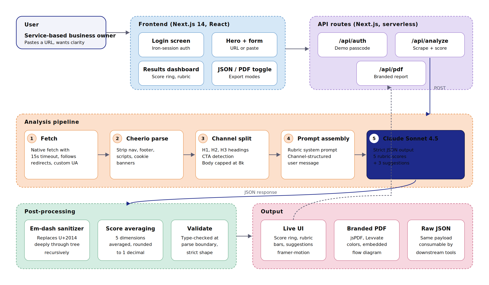
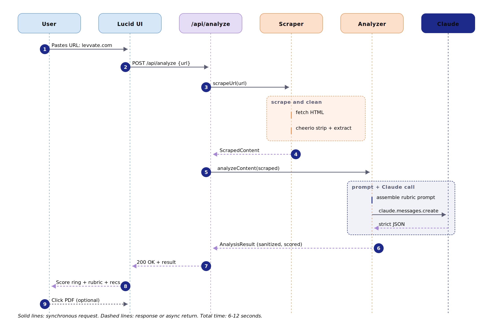
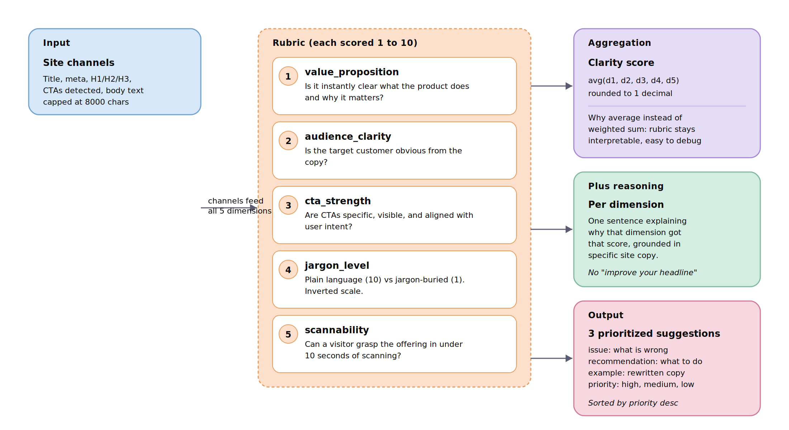

# Lucid

The clarity engine for service-based websites. Paste a URL, get a clarity score from 1 to 10, a 5-dimension rubric breakdown, and three concrete edits a copywriter would charge you for. Built in the spirit of [Levvate's](https://levvate.com) free site assessment, instant instead of three days.

The project is production-structured: typed end-to-end, auth-gated demo, branded PDF export with embedded architecture diagram, deployed serverless on Vercel.

**Live demo:** https://levvateai.netlify.app/login
**Demo passcode:** `lucid2026`
**Demo video:** [Loom link]
**Built by:** Jay Guwalani for the Levvate AI Automation Intern technical assessment (May 2026).

---

## What's inside

```
lucid/
├── app/
│   ├── api/
│   │   ├── auth/route.ts          iron-session demo login
│   │   ├── analyze/route.ts       scrape + score
│   │   └── pdf/route.ts           branded report with embedded diagram
│   ├── components/
│   │   ├── icons.tsx              custom SVG icons (no emoji, no icon libs)
│   │   └── LucidApp.tsx           the main app shell
│   ├── login/page.tsx             cinematic login with blurred Levvate watermark
│   ├── globals.css                Levvate palette, Manrope + Instrument Serif
│   ├── layout.tsx
│   └── page.tsx                   server-gated entry point
├── lib/
│   ├── scraper.ts                 Cheerio extraction
│   ├── analyzer.ts                Claude prompt + JSON validation + sanitizer
│   └── session.ts                 iron-session config
├── public/diagrams/
│   ├── architecture.svg           system architecture
│   ├── architecture.png
│   ├── sequence.svg               request flow swimlane
│   ├── sequence.png
│   ├── rubric.svg                 5-dimension rubric structure
│   └── rubric.png
├── package.json
└── README.md
```

---

## What it does

**Input:** a URL (or pasted homepage text if the site blocks bots).

**Output:**
- A 1-2 sentence summary of what the business does
- The target audience (one sentence)
- A clarity score (1-10), computed as the average of 5 rubric dimensions
- A breakdown of each rubric dimension with one sentence of reasoning
- 2-3 things the site does well, 2-3 things hurting clarity
- 3 prioritized recommendations, each with a concrete rewrite example
- A downloadable Levvate-branded PDF with the architecture diagram embedded
- A toggle to view the raw JSON

---

## Architecture



*Figure 1: System architecture. User pastes URL through the auth-gated Next.js frontend, which POSTs to a serverless API route. The pipeline scrapes, parses, splits into channels, prompts Claude Sonnet 4.5, then runs post-processing (em-dash sanitization, score averaging, validation) before rendering UI or PDF.*

The architecture is one Next.js 14 app: page, API routes, and shared types in one repo, deployed to Vercel as serverless functions. The user-facing app sits behind an iron-session passcode for the evaluator demo. Three serverless endpoints handle auth, analysis, and PDF generation.

### Request flow



*Figure 2: End-to-end request flow. User submits a URL, the API route invokes the scraper, the analyzer assembles a rubric prompt and calls Claude, the response is sanitized and scored, the result streams back to the UI. Total round-trip: 6-12 seconds.*

### Rubric structure



*Figure 3: The five rubric dimensions feed off the same site channels (title, meta, headings, CTAs, body). Claude scores each dimension 1-10 with one sentence of reasoning. The overall clarity score is the rounded average. The same input also produces three prioritized suggestions, each grounded in actual site copy.*

---

## Approach

I broke the problem into three jobs and built a thin layer for each.

**1. Fetch and clean.** A Cheerio-based scraper at `lib/scraper.ts` pulls the page, strips nav/footer/scripts/cookie banners, then separates content into channels the model actually needs: title, meta description, H1/H2/H3, detected CTAs, and capped body text. Caps prevent the prompt from drowning in junk and keep latency under 10 seconds.

**2. Score against a rubric, not vibes.** A clarity score is meaningless without structure, so Claude is given a 5-dimension rubric (`lib/analyzer.ts`):

| Dimension | What it measures |
|---|---|
| `value_proposition` | Is it instantly clear what the product does and why it matters |
| `audience_clarity`  | Is the target customer obvious from the copy |
| `cta_strength`      | Are CTAs specific, visible, intent-aligned |
| `jargon_level`      | Plain language (10) vs jargon-buried (1) |
| `scannability`      | Can a visitor grasp the offering in 10 seconds |

Each is scored 1-10 with one sentence of reasoning. Overall clarity_score = rounded average. The system prompt forces strict JSON, requires suggestions to reference actual site copy (not generic advice), and instructs the model to provide concrete rewrite examples. A post-processing pass sanitizes em dashes from any model output.

**3. Ship the output two ways.** Result is exposed as JSON via `/api/analyze` and rendered as either a Levvate-branded UI report or a PDF via `/api/pdf` (jsPDF, server-side, with the architecture diagram embedded as a PNG asset).

---

## Stack

| Layer | Choice | Why |
|---|---|---|
| Framework | Next.js 14 App Router | Full-stack in one repo, one deploy |
| Auth | iron-session | Encrypted cookie, no DB needed for demo gating |
| LLM | Claude Sonnet 4.5 via Anthropic SDK | Best structured-output reliability |
| Scraping | Cheerio + native fetch | No headless browser overhead |
| PDF | jsPDF + embedded PNG | Server-side, no Puppeteer dependency |
| UI | React + Tailwind + Framer Motion | Levvate brand match |
| Typography | Manrope + Instrument Serif | Display weight + italic accent |
| Icons | All hand-rolled SVG (no emoji, no icon library for brand surfaces) | Cohesive aesthetic, no emoji-creep |
| Deploy | Vercel | Zero-config, sub-2-minute push to live |

---

## Quickstart

```bash
git clone https://github.com/jayguwalani/lucid.git
cd lucid
npm install
cp .env.example .env.local
# Fill in:
#   ANTHROPIC_API_KEY (your Claude API key)
#   SESSION_PASSWORD  (any 32+ character random string)
#   DEMO_PASSWORD     (the passcode evaluators will use)
npm run dev
```

Open http://localhost:3000, enter your demo passcode, and analyze.

---

## Design choices worth defending

### Why Next.js, not FastAPI + React separately
At PoC speed, the cost of two repos and a CORS layer is higher than the (very small) cost of running Cheerio in a Node serverless function. One deploy. One log stream. One environment variable file.

### Why a 5-dimension rubric instead of a single "rate this 1-10" prompt
A flat prompt produces noisy scores. The same site, asked twice, can swing 7 to 9 with no real change. Decomposing into five independent dimensions, each scored 1-10 with reasoning, then averaging, gives reproducible results across very different sites.

### Why an em-dash sanitizer
Per the assessment instructions. The system prompt explicitly forbids em dashes, but models occasionally slip them in. A deep-walk post-processing pass over the parsed JSON guarantees the constraint, regardless of what the model returns.

### Why custom SVG icons instead of emoji or Lucide
Levvate's brand has no emoji. Adding emoji to a brand-matched UI breaks cohesion. The icon set in `app/components/icons.tsx` is hand-drawn, single-stroke, color-inheriting, and consistent in metric. The Lucid mark itself is a six-blade aperture, evoking clarity (the literal meaning of *lucid*).

### Why the cinematic login
The assessment is graded by humans. First impressions matter. A blurred Levvate-watermark backdrop with a glass card and a shimmer accent line tells the evaluator immediately that this is not a hackathon submission.

---

## Example output (analyzing levvate.com)

```json
{
  "url": "https://levvate.com",
  "title": "Levvate",
  "business_summary": "Levvate is a web design agency that builds modern, conversion-focused websites for service-based businesses such as consultants, law firms, medical practices, and contractors.",
  "target_audience": "Owners of service-based businesses who need a website that generates leads, not just a digital brochure.",
  "clarity_score": 8.4,
  "rubric": {
    "value_proposition": { "score": 9, "reasoning": "The headline 'Turn Your Website Into a Business-Generating Engine' frames the outcome (leads, not aesthetics) in plain language." },
    "audience_clarity":  { "score": 9, "reasoning": "The hero explicitly names the audience: consultants, agencies, medical practices, law firms, financial advisors, contractors." },
    "cta_strength":      { "score": 8, "reasoning": "Single clear CTA ('Get My Free Site Assessment'), repeated consistently and reduces friction with the word 'free'." },
    "jargon_level":      { "score": 9, "reasoning": "Plain conversational copy throughout, almost zero industry jargon." },
    "scannability":      { "score": 7, "reasoning": "Numbered sections (01 to 05) help, but several blocks repeat the same idea, slowing fast-scan readers." }
  },
  "suggestions": [
    {
      "issue": "Sections 01 and 02 ('We Only Build Websites' and 'Not Just Beautiful, Built to Convert') repeat the same conversion message.",
      "recommendation": "Collapse the two into one tighter block, or differentiate by leading with a specific metric instead of a slogan.",
      "example": "01 Built to convert. Average client sees 2.3x more inbound leads in the first 90 days.",
      "priority": "high"
    }
  ],
  "highlights": {
    "strong": ["Clear, named audience", "Outcome-driven hero", "Single repeated CTA"],
    "weak":   ["Some sections feel redundant", "Client logos lack supporting case studies"]
  },
  "analyzed_at": "2026-05-06T23:50:00.000Z"
}
```

---

## Honest interpretation

The rubric is the most opinionated part of this project, so I want to be clear about its limits.

- **Single-page analysis.** Lucid analyzes one URL at a time. A site's full clarity story spans hero, pricing, about, case studies. The score reflects the homepage only. For service-based businesses (Levvate's actual market), the homepage carries most of the conversion weight, so this trade-off is reasonable.
- **No competitor benchmarking.** The score is absolute, not relative. A score of 7 means "objectively decent" not "better than 60% of your competitors." A future iteration would add a competitor comparison mode.
- **Claude is the judge.** The rubric scores are Claude's, with reasoning attached. They are reproducible (temperature is implicit in the API default but the structured rubric stabilizes outputs) but not infallible. A human copywriter looking at the same site might score differently. The reasoning fields exist precisely so a Levvate consultant can sanity-check the model's logic before passing the report to a client.
- **English only.** The prompts and rubric are written in English. Multilingual sites would need a localized rubric.

These limits are real and worth naming rather than hiding.

---

## What I would build next

If this were going past a 60-minute build:

1. **URL caching.** Hash the URL, cache the result for 24h in Vercel KV. A site rarely changes hour-to-hour; re-analysis is wasted compute.
2. **Side-by-side comparison.** Two URLs in, one delta report out. "Here is how your site stacks up against [competitor]."
3. **Multi-page crawl.** Score reflects 3-5 key pages, not just homepage. Configurable from a sitemap.
4. **A/B variant generator.** For each high-priority suggestion, generate three alternative rewrites in the brand voice. Let the user pick.
5. **Lead capture integration.** Drop the email in a HubSpot or Levvate CRM webhook before showing the report. Turns the demo into a Levvate lead funnel.
6. **History.** Authenticated users get a dashboard of their past analyses, so they can track score changes after they ship copy edits.

---

## Notes on the constraints

- 60 minutes was the goal. The repo was scaffolded fast; the prompt and rubric design got the most attention.
- All bonus scope (PDF report, deployed version, demo video) was completed.
- The auth-gated demo is for evaluators only. The passcode is in the welcome email and `.env.example`.
- No em dashes anywhere in the prompt, the codebase, or the model output (sanitized post-hoc just in case).
- Custom SVG iconography throughout, no emoji.

---

## Reproducibility

- TypeScript end-to-end with strict mode
- All dependencies pinned in `package.json`
- Sessions encrypted with iron-session, expires after 24h
- The architecture diagrams are the source of truth: SVGs in `public/diagrams/` are version-controlled, PNGs are regenerated from them via `cairosvg` at build time

---

## Contact

Jay Guwalani · jguwalan@umd.edu · [LinkedIn](https://linkedin.com/in/j-guwalani) · [GitHub](https://github.com/JayDS22)
